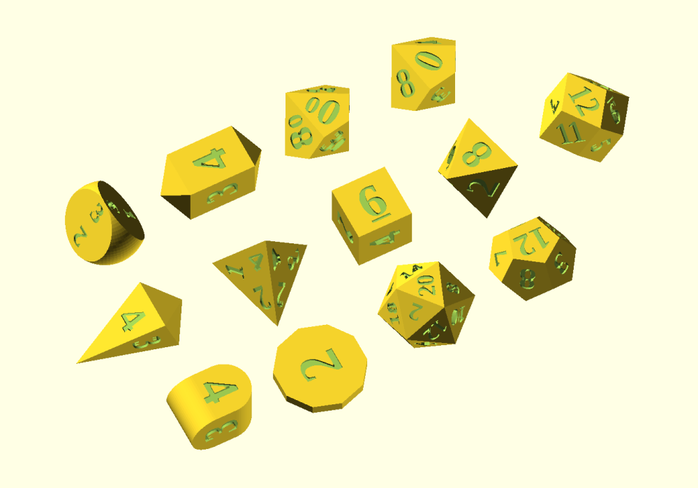

# PolyDiceGenerator

A customizable **Polyhedral Dice Generator** for OpenSCAD.

## Requirements

- OpenSCAD <http://www.openscad.org>
- The BOSL2 library <https://github.com/revarbat/BOSL2#installation>

## Adding Text to Dice

Text, numbers, underscores, and symbols are added to dice by creating lists of values. The elements within each list are rendered in the same order that the sides of the die are generated and is controlled by the BOSL2 library. Distributing elements to specific sides of each die is done by reordering the elements within each list.

***Note:** Element positions correlate across all lists, e.g., if the numbers list has `"9"` in the first position, and you want to add an underscore, the `"_"` should also be in the first position in the underscores list.*

***Note:** Each list will contain a number of elements equal to the number of characters rendered on the die, e.g., 6 elements for the d6, 8 for the d8, 12 for the d4, etc. There is one exception:*

- *A crystal d4c is a 6 sided cube with 4 numbered sides and 2 opossing points. The distribution lists for the d4c contain 6 elements, 2 of them being `" "` blank.*

### Distribution Lists

- **Text** - Consists of numbers, letters, or properly escaped unicode characters within the defined font (e.g., `"\u263C"` will produce ☼). If you'd like to use periods instead of underscores, that can be done in this list (e.g., `"6."` and `"9."`). The following example shows the standard number distribution for the d6.

  ***Example:*** `d6_text=["1","3","5","2","4","6"];`
  - Bracket enclosed `[]` quoted `" "` elements seperated by commas `,`.
  - Blanking out an element `" "` will prevent it from being rendered.
  - The font is set using the `text_font`variable.

- **Symbols** - A list for adding symbols. In the following example the symbol mapped to the letter `"K"` will be rendered in place of the number 4.

  ***Example:*** `d6_symbols=[undef,undef,undef,undef,"K",undef];`
  - Bracket enclosed `[]` quoted `" "` characters seperated by commas `,`.
  - The value `undef` or `"undef"` is used where a symbol is not wanted.
  - The symbol mapped to the character entered will be rendered using the `symbol_font` variable.

  ***Note:** After making changes to symbol elements the Customizer may wrap unquoted `undef` values in quotes as `"undef"`. The quotes will not affect opperation and can be ignored.*

- **Underscores** - A list for adding underscores. In the following example an underscore will be rendered under the number 6.

  ***Example:*** `d6_underscores=[" "," "," "," "," ","_"];`
  - Bracket enclosed `[]` quoted `" "` underscores seperated by commas `,`.
  - Blanking out an element `" "` will prevent an underscore from being rendered.
  - Underscores are rendered using the `underscore_font` variable.

- **Rotation** - A list for altering the default rotation of a particular element. In this example the number `5` will be rotated 90 degrees.

  ***Example:*** `d6_rotate=[0,0,90,0,0,0];`
  - Bracket enclosed `[]` non-quoted numbers (in degrees) seperated by commas `,`.
  - A zero value `0` will use the default rotation for that element.

- **Adjust Text Size** - A list for altering the text size of individual elements. In this example the size of number `1` will be increased.

  ***Example:*** `d6_adj_size=[15,0,0,0,0,0];`
  - Bracket enclosed `[]` non-quoted numbers seperated by commas `,`.
  - The values entered here will be added to the die's existing `d(n)_text_size` value.

- **Adjust Vertical Push** - A list for altering the vertical offset of individual elements. In this example the number `3` will be pushed up by `2`.

  ***Example:*** `d6_adj_v_push=[0,2,0,0,0,0];`
  - Bracket enclosed `[]` non-quoted numbers seperated by commas `,`.
  - The values entered here will be added to the die's existing `d(n)_text_v_push` value.

- **Adjust Horizontal Push** - A list for altering the horizontal offset of individual elements. In this example the number `3` will be pushed to the right by `2`.

  ***Example:*** `d6_adj_v_push=[0,2,0,0,0,0];`
  - Bracket enclosed `[]` non-quoted numbers seperated by commas `,`.
  - The values entered here will be added to the die's existing `d(n)_text_h_push` value.

- **Adjust Spacing** - A list for altering the spacing between double digit elements. In this example the spacing between the `1` and `2` in the number `12` of the `d12` will be increased by `0.2`.

  ***Example:*** `d12_adj_spacing=[0,0,0,0,0,0,0,0,0,0,0.2,0];`
  - Bracket enclosed `[]` non-quoted numbers seperated by commas `,`.
  - The values entered here are added to the die's existing `d(n)_text_spacing` value.
  - Only avaliable where double digits are likely to occur.

- **Adjust Depth** - A list for altering the depth of individual elements. In this example the number `5` will be extruded by an assitional `0.5`mm.

  ***Example:*** `d6_adj_depth=[0,0,0.5,0,0,0];`
  - Bracket enclosed `[]` non-quoted numbers seperated by commas `,`.
  - The values entered here will be added to the global `text_depth` value.

***Note:** Some dice will not utilize all lists. The d4, for example, has no need for underscores, so that list is not avaliable.*

## Variables

### Fonts

|Variable Name    |Description|
|---              |---        |
|`text_font`      |Name of font to use for numbers.    |
|`underscore_font`|Name of font to use for underscores.|
|`symbol_font`    |Name of font to use for symbols.    |

***Note:** These values are not the filename of the font, but the logical font name (internally handled by the fontconfig library). This can also include a style parameter. A list of installed fonts & styles can be obtained using the font list dialog (Help > Font List).*

***Note:** Fonts must be installed on the system as well as coppied into the OpenSCAD install location /font directory. OpenSCAD requires a restart to load newly installed fonts.*

### Dice to Draw

|Variable Name|Description|
|---          |---        |
|`d(n)`       |Checked dice will be rendered.|

### Dice Size

|Variable Name|Description|
|---          |---        |
|`d(n)_size`  |Size (in millimeters) of each die.|

***Note:** Variables are converted into a percentage of the die's size. This allows them to uniformally scale while increasing or decreasing its size.*

### Depth, Stroke, and Bumpers

|Variable Name  |Description|
|---            |---        |
|`text_depth`   |Extrusion depth (in millimeters) for numbers, underscores, and symbols.|
|`text_stroke`  |Stroke adjustment for numbers, and underscores.|
|`symbol_stroke`|Stroke adjustment for symbols.|
|`add_bumpers`  |If true, bumpers will be drawn around each face set to `true` in the die's d(n)_bumpers list.|
|`bumper_size`  |Size of bumpers (in millimeters) |

### Rounding

|Variable Name    |Description|
|---              |---        |
|`edge_rounding`  |Edge rounding adjustment for all dice.|
|`corner_rounding`|Corner are rounded using a circumscribed sphere.|
|`corner_clipping`|Corners are clipped using each die's dual polyhedron.|

***Note:** Only one rounding type is possible at a time. `corner_rounding` and `corner_clipping` are not compatible with `d10` or `d00` `length_mod` adjustments.*

### Standard Variables for all Dice

|Variable Name       |Description|
|---                 |---        |
|`d(n)_text_size`    |Size adjustment for numbers.|
|`d(n)_text_v_push`  |Vertical offset adjustment for numbers.|
|`d(n)_text_h_push`  |Horizontal offset adjustment for numbers.|
|`d(n)_text_spacing` |Spacing adjustment for numbers with multiple characters (e.g., double digit numbers, or say a 6 with a period like `"6."`). Think of this as a kerning adjustment.|
|`d(n)_num_4_h_push` |Horizontal offset adjustment for the number `"4"`.|
|`d(n)_text`         |User-defined list for distributing numbers. The order of elements in this list can be referenced when adding symbols, underscores, and rotation.|
|`d(n)_symbols`      |User-defined list for adding symbols.|
|`d(n)_symbol_size`  |Size adjustment for symbols.|
|`d(n)_symbol_v_push`|Vertical offset adjustment for symbols.|
|`d(n)_symbol_h_push`|Horizontal offset adjustment for symbols.|
|`d(n)_custom_under` |User-defined list for adding underscores.|
|`d(n)_under_size`   |Size adjustment for underscores.|
|`d(n)_under_v_push` |Vertical offset adjustment for underscores.|
|`d(n)_under_h_push` |Horizontal offset adjustment for underscores.|
|`d(n)_bumpers`      |User-defined list used to add bumpers around each face set to `true`. Enabled by setting `add_bumpers` to `true`.|
|`d(n)_custom_rotate`|User-defined list of angles for adjusting an elements rotation.|
|`d(n)_adj_size`     |User-defined list allowing size adjustment of individual text elements.|
|`d(n)_adj_v_push`   |User-defined list allowing vertical offset adjustment of individual text elements.|
|`d(n)_adj_h_push`   |User-defined list allowing horizontal offset adjustment of individual text elements.|
|`d(n)_adj_depth`    |User-defined list allowing depth adjustment of individual text elements.|

### d2 Coin

|Variable Name|Description|
|---          |---        |
|`d2_sides`   |Number of sides adjustment for `d2`.|
|`d2_height`  |Height adjustment for `d2`.|

### d3 Rounded Triangular Prism

- Standard Variables Only (see above)

### d4 Tetrahedron

- Standard Variables Only (see above)

### d4c Crystal

|Variable Name          |Description|
|---                    |---        |
|`d4c_body_length`      |Body length adjustment for `d4c`. |
|`d4c_point_length`     |Point length adjustment for `d4c`.|
|`d4c_pip_dist`         |User-defined list for adding and distributing pips to the `d4c`.|
|`d4c_pip_sides`        |Number of sides adjustment for `d4c` pips.|
|`d4c_pip_size`         |Size adjustment for `d4c` pips.|
|`d4c_pip_offset`       |Adjustment for distance between `d4c` pips.|
|`d4c_pip_symbol_dist`  |User-defined list for setting up symbol distribution in pip patterns on the `d4c`. The list should contain numbers `"1"` thru `"4"`, the order of which will likely mimic those set in `d4c_custom_dist`.|
|`d4c_pip_symbols`      |User-defined list for adding symbols in place of `d4c` pips.|
|`d4c_pip_symbol_rotate`|User-defined list of angles for adjusting `d4c` pip symbol rotation.|

### d4i Infinity

|Variable Name          |Description|
|---                    |---        |
|`d4i_body_length`      |Body length adjustment for `d4i`. |
|`d4i_pip_dist`         |User-defined list for adding and distributing pips to the `d4i`.|
|`d4i_pip_sides`        |Number of sides adjustment for `d4i` pips.|
|`d4i_pip_size`         |Size adjustment for `d4i` pips.|
|`d4i_pip_offset`       |Adjustment for distance between `d4i` pips.|
|`d4i_pip_symbol_dist`  |User-defined list for setting up symbol distribution in pip patterns on the `d4i`. The list should contain numbers `"1"` thru `"4"`, the order of which will likely mimic those set in `d4i_custom_dist`.|
|`d4i_pip_symbols`      |User-defined list for adding symbols in place of `d4i` pips.|
|`d4i_pip_symbol_rotate`|User-defined list of angles for adjusting `d4i` pip symbol rotation.|

### d4p Pyramid

|Variable Name    |Description|
|---              |---        |
|`d4p_body_length`|Body length adjustment for `d4p`. |
|`d4p_base_length`|Base length adjustment for `d4p`.|

### d6 Cube

|Variable Name         |Description|
|---                   |---        |
|`d6_angle_text`       |Angle `d6` numbers by 45 degrees.|
|`d6_pip_dist`         |User-defined list for adding and distributing pips to the `d6`.|
|`d6_pip_sides`        |Number of sides adjustment for `d6` pips.|
|`d6_pip_size`         |Size adjustment for `d6` pips.|
|`d6_pip_offset`       |Adjustment for distance between `d6` pips.|
|`d6_pip_symbol_dist`  |User-defined list for setting up symbol distribution in pip patterns on the `d6`. The list should contain numbers `"1"` thru `"6"`, the order of which will likely mimic those set in `d6_custom_dist`.|
|`d6_pip_symbols`      |User-defined list for adding symbols in place of `d6` pips.|
|`d6_pip_symbol_rotate`|User-defined list of angles for adjusting `d6` pip symbol rotation.|

### d8 Octahedron

- Standard Variables Only

### d10 Trapezohedron

|Variable Name   |Description|
|---             |---        |
|`d10_length_mod`|Point length adjustment for the `d10`.|

### d00 Trapezohedron

|Variable Name     |Description|
|---               |---        |
|`d00_length_mod`  |Point length adjustment for the `d00`.|
|`d00_angle_text`  |Angle `d00` numbers by `90` degrees.|
|`d00_0_size`      |Size adjustment for the `d00` 2nd digit `"0"`. Only applies when `d00_angle_text` is `checked` or set to `true`.|
|`d00_0_padding`   |Spacing adjustment between the `d00` 1st digit number and 2nd digit `"0"`. Only applies when `d00_angle_text` is `checked` or set to `true`.|
|`d00_10_h_push`   |Horizontal push adjustment for `d00` `#10`. Only applies when `d00_angle_text` is `checked` or set to `true`.|
|`d00_10_0_padding`|Spacing adjustment for `d00` `#10` 2nd digit `"0"`. Only applies when `d00_angle_text` is `checked` or set to `true`.|

### d12 Dodecahedron

- Standard Variables Only

### d12r Rhombic Dodecahedron

- Standard Variables Only

### d20 Icosahedron

- Standard Variables Only

### Hidden Variables

- Variables declaring the distribution of numbers, underscores, and rotation for `Standard`, `DiceLab`, and future numbering layouts. These un-editable *default* values are hidden from the customizer.

## Changelog

- [CHANGELOG.md](CHANGELOG.md)
